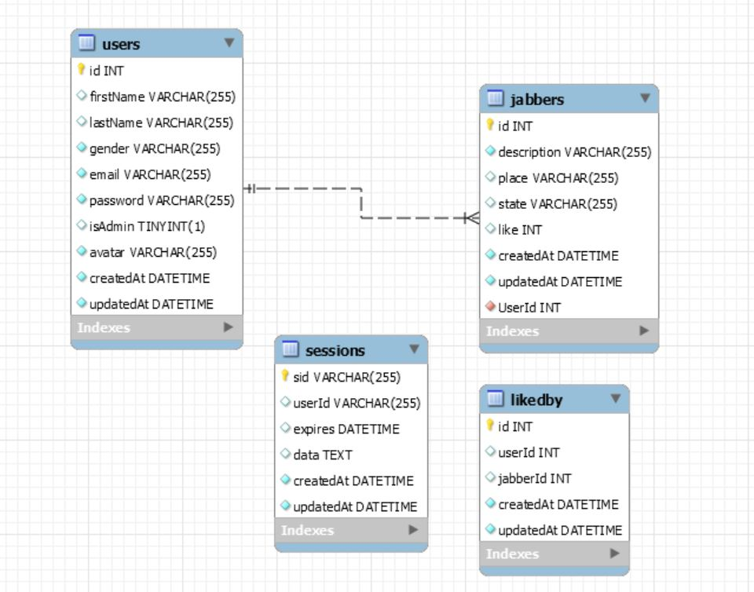

## Huddle
This is an appication that is designed using Express, Handlebars, Sequelize ORM using MySQL database. Users have to be registered and Authenticated using passport. Huddle page is responsive and use Bootstrap framework.
## Table of contents
* [General Info](#general-info)
* [Technologies](#technologies)
* [Features](#features)
* [Usage](#usage)
* [Application Demo](#application-demo)
* [Contributing](#contributing)
* [Questions](#questions)
## General Info 
This app is available in GitHub at https://github.com/vkalaparthy/2020-Project2  & is deployed in Heroku at [Website](https://project2-team8-dmtv.herokuapp.com/)
## Techonologies 
Used NPM Express, Express-Handlebars, Sequelize for app developemnt and bcrypt for password-hashing along with passport for authentication.  Used ESLint to enforce the coding standards with Travis CI.
## Features
This applications need a user registartion.  Once the user is registerd, he/she can  
Login   
Jabber   
See and Like other people's Jabbers  
Change the user information   
Logout   
Delete themselves  
For Jabber:   
User can post jabbers  
Edit jabbers   
Delete jabbers  
See other people's jabbers  
Like other people's jabbers   
   
* User Interface after Login:  

## Usage
* Clone the repository from https://github.com/vkalaparthy/2020-Project2
* run npm install to install the packages
* Add `.env` file with the following content:  
SEQUELIZE_USER=your_mysql_db_user  
SEQUELIZE_PASSWORD=your_mysql_db_password  
SEQUELIZE_HOST=your_mysql_db_host  
AUTH_SECRET=your_auth_secret_key  
ADMIN_USER_PWD=admin_password  
USER_PWD=user_pwd  
FORCE_SYNC=true_or_false   
TU=mysql_user   
TP=mysql_password  
  
* Run "nodemon serer.js"    
  
* DB Schema  
  
  
   
  
    
## Application Demo
* Register:  
 
* Application demo:  

## License
Copyright © 2020-present, Vani Kalaparthy. Released under the MIT License.  
## Contributing
Below are the Team that worked on this project. 

  
   
* Vani Kalaparthy
  
   * E-mail: kalaparthy.vani@gmail.com
   * GitHub: https://github.com/vkalaparthy
   * Portfolio: https://vkalaparthy.github.io/
   
* Dianna Mack
  
   * E-mail: dianna.mack@yahoo.com
   * GitHub: https://github.com/dmack095-07
   * Portfolio: https:
* Mark Speer
  
   * E-mail: 
   * GitHub: https://github.com/mark-speer
   * Portfolio: https://

* Toks Desalu

   * E-mail: desalu.developer@gmail.com
   * GitHub: https://github.com/desalu
   * Portfolio: https://   
## Tests
Only manual testing
## Questions
 Contact Vani Kalaparthy for any questions:
 * https://github.com/vkalaparthy
 * kalaparthy.vani@gmail.com 

